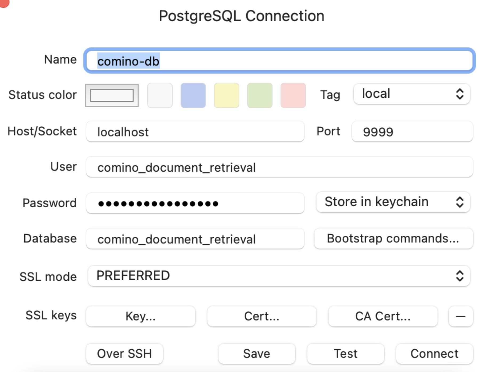

# Connect to the database
## SSH into ec2 instance:
1. Open command line programatic access and export the values:
```sh
export AWS_ACCESS_KEY_ID= XXX
export AWS_SECRET_ACCESS_KEY=YYY
export AWS_SESSION_TOKEN=ZZZ
```
2. Create a private key and permission it appropriately
Create a file 
```sh
touch dd
```
Open the file
```sh
open dd
```
Save the content of Comino-Document-Retrieval_Stg_private_key (this variable is in the  AWS secrets manager)

Change the file extension
```sh
cp dd dd.pem
```
Change file permission
```sh
chmod 600 dd.pem
```

3. save the variables in the terminal
```sh
JUMP_BOX_NAME=$(aws ssm get-parameter --name /comino-staging-jump-box-instance-name --query Parameter.Value)
JUMP_BOX_PORT_NUMBER=$(aws ssm get-parameter --name /comino-staging-jump-box-instance-port-number --query Parameter.Value)
JUMP_BOX_LOCAL_PORT_NUMBER=$(aws ssm get-parameter --name /comino-staging-jump-box-instance-local-port-number --query Parameter.Value)
POSTGRES_HOST_NAME=$(aws ssm get-parameter --name /comino/staging/postgres-hostname --query Parameter.Value)
POSTGRES_PORT=$(aws ssm get-parameter --name /comino/staging/postgres-port --query Parameter.Value)
```
4. Setup port forwarding which creates a tunnel between your local machine and the jump host
```sh
aws ssm start-session --target  ${JUMP_BOX_NAME//\"} --document-name AWS-StartPortForwardingSession --parameters '{"portNumber":["'${JUMP_BOX_PORT_NUMBER//\"}'"],"localPortNumber":["'${JUMP_BOX_LOCAL_PORT_NUMBER//\"}'"]}'
```


5. On a second terminal run steps 1 and 3 followed by:
```sh
ssh -i dd.pem ec2-user@localhost -p ${JUMP_BOX_LOCAL_PORT_NUMBER//\"} -N -L 9999:${POSTGRES_HOST_NAME//\"}:${POSTGRES_PORT//\"}
```

6. Print Comino database configuration
```sh
echo $POSTGRES_PORT &&
aws ssm get-parameter --name /comino-staging-jump-box-instance-name --query Parameter.Value 
aws ssm get-parameter --name /comino-staging-jump-box-instance-port-number --query Parameter.Value --with-decryption
aws ssm get-parameter --name /comino-staging-jump-box-instance-local-port-number --query Parameter.Value
aws ssm get-parameter --name /comino/staging/postgres-hostname --query Parameter.Value
aws ssm get-parameter --name /comino/staging/postgres-port --query Parameter.Value
```
7. Setup a connection to the database from your favourite SQL tool with the details you just retrieved
    - Here's how it should look in TablePlus: 
