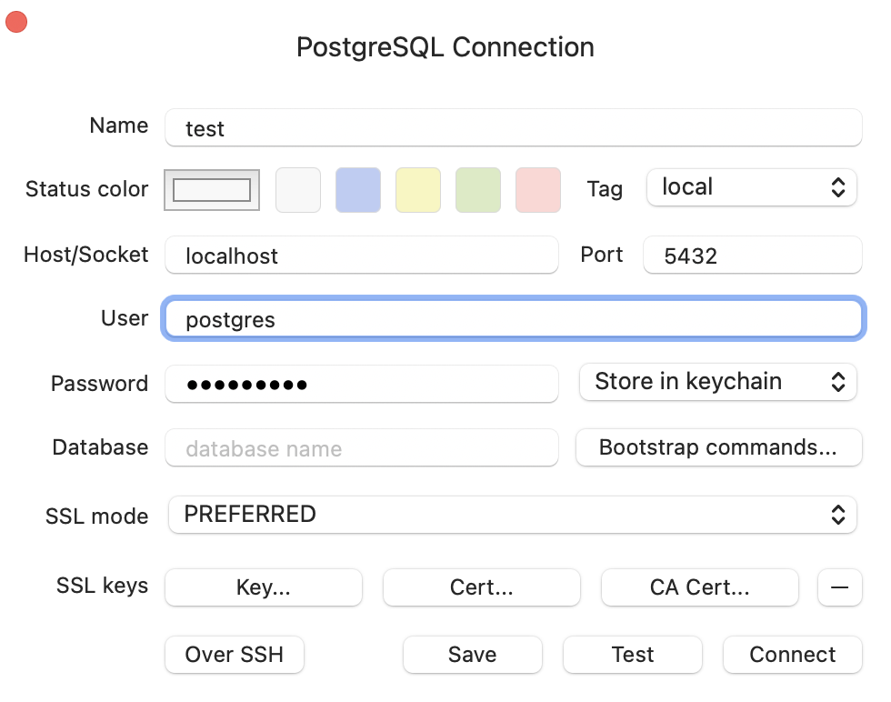

# Steps to create a test database

1. intall docker
2. loggin to docker 
  ```sh
  docker login
  ```
3. download container
  ```sh
  docker run -e 'ACCEPT_EULA=Y' -e 'SA_PASSWORD=Password1' --name sqlserver -p 5432:5432 -d mcr.microsoft.com/mssql/server:2019-CU14-ubuntu-20.04
  ```

4. start container
  ```sh
  docker start sqlserver
  ```

5. verify if the container is created correctly 
  ```sh
  docker ps 
  ```

6. open a database manager such as TablePlust to connect to the database just created
 
where the password is Password1

7. Create a database by pressing Comand + K

8. Create 5 tables:
- CCDocument
- W2Attachment
- W2Email
- E2Image
- W2Page

9. Fill the tables with the set of information you wish to test. To avoid errors verify the sql queries in the project to determine what columns are being used. Examples of each table can be found in the docs folder.